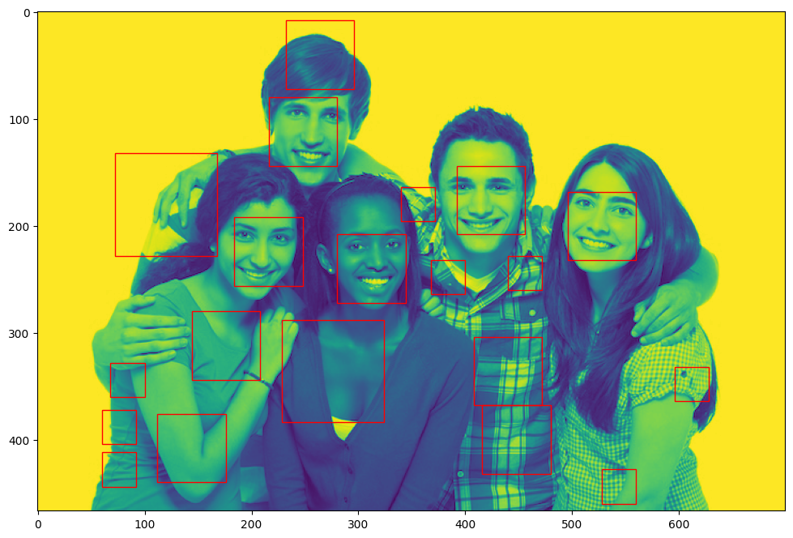

# 5IF OT2 - Projet Deep Learning



## Structure

```
data/                                       # Data directory (not versioned)
├── train_images/                           # Training images
│   ├── 0/                                  # Images of class 0 (no face)
│   └── 1/                                  # Images of class 1 (face)
├── test_images/                            # Testing images for model evaluation
└── train_images_all/                       # Training images including base dataset and hard negative mining dataset
models/                                     # Models directory (not versioned)
└── model_[yyyy-MM-dd_hh-dd-mm]/
    ├── model.pth       # Model weights     # Model file
    └── metadata.json   # Model metadata    # Metadata file
notebooks/                                  # Jupyter notebooks directory
└── detection.ipynb                         # Notebook used for face detection
results/                                    # Results directory
└── model_[yyyy-MM-dd_hh-dd-mm]/            # Model directory
    └── results_[yyyy-MM-dd_hh-dd-mm].json  # Metrics file
src/                                        # Source code directory
├── reinforcement/                          # Reinforcement learning code
│   ├── config.py                           # Configuration and hyper-parameter values for reinforcement learning
│   ├── extract.py                          # Image extraction functions for reinforcement learning
│   ├── scale_sliding_image_dataset.py      # PyTorch dataset to iterate over sliding windows of images
├── config.py                               # Configuration and hyper-parameter values
├── data.py                                 # Data processing functions
├── detection_utils.py                      # Face detection utility functions
├── detection.py                            # Face detection functions
├── device.py                               # Device selection function
├── metadata.py                             # Model metadata data structure
├── net.py                                  # Model definition
├── results.py                              # Model evaluation data structure
├── test.py                                 # Model testing script
└── train.py                                # Model training script
test_runs.md                                # List of test runs and results
```

## Installation

### Dependencies

```
pip -m venv .venv
source .venv/bin/activate # On Windows, use .venv\Scripts\activate.bat
pip install -r requirements.txt
```

### Data

Download the dataset from Moodle and extract it in the `data/` directory. The directory should look like this:

```
data/
├── train_images/
│   ├── 0/
│   └── 1/
├── test_images/
│   ├── 0/
╵   └── 1/
```

## Usage

### Training

To train a model, run the following command:

```
python -m src.train
```

The model will train from the images defined in the configuration file (default: `data/train_images/`). The model will be saved in the `models/` directory along with its metadata.

### Testing

To test a model, run the following command:

```
python -m src.test
```

The latest model will be loaded from the `models/` directory and tested on the images defined in the configuration file (default: `data/test_images/`). The results will be saved in the `results/` directory.

### Reinforcement Learning

To run the reinforcement learning algorithm, you need to get a dataset of images without faces.

1. Run the following command to extract the images from the dataset (look at the extract file to change the dataset path):

```
python -m src.reinforcement.extract
```

The images will be saved in the directory specified in the extract file.

2. Move/copy the extracted images to the `0/` directory in the training images directory.

3. Rerun the training script to train the model on the new dataset.

### Face detection

The face detection algorithm is implemented in the `notebooks/detection.ipynb` notebook. You can run it in Jupyter Notebook or Jupyter Lab.

#### Setup

1. Update the environment variables defined in the notebook to match your configuration.
2. Update the model directory in the `load_state_dict` function call to the one you want to use for face detection.
3. Update the `src_path` variable to the image you want to test.

### Face detection metrics

To run face detection on a set of images with labels, run the following command:

```
python -m src.detection
```

The code uses this dataset [https://www.kaggle.com/datasets/ngoduy/dataset-for-face-detection](https://www.kaggle.com/datasets/ngoduy/dataset-for-face-detection).

Update the `model_path` and the `dataset_dir` variables in the `src/detection.py` file to match your configuration.

This code computes the following metrics:

- Noise ratio: the ratio of false positives to the total number of detections (e.g. if there are 10 detections and 2 are noise, the noise ratio is 0.2)
- Face accuracy: for the detected faces (without noise), the average overlap with the ground truth faces (e.g. if there are two faces with 0.5 and 0.7 overlap, the face accuracy is 0.6)